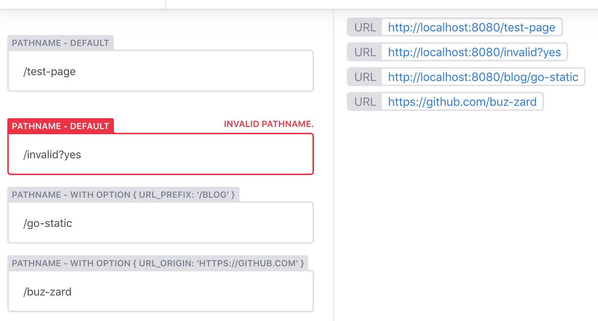

# netlify-cms-widget-pathname

[Check out a demo!](https://netlify-cms-widget-pathname.netlify.com/demo)

This widget provider pathname validation and url preview. This might be handy if
you construct url's based on input field.

[![npm version][version-badge]][version]
[![Build Status][build-badge]][build]
[![License: MIT][license-badge]][license]

[![semantic-release][semantic-release-badge]][semantic-release]
[![module formats: cjs][module-formats-badge]][unpkg-bundle]
[![code style: prettier][code-style-badge]][code-style]



## Install

As an npm package:

```shell
npm install --save netlify-cms-widget-pathname
```

```js
import { PathnameControl, PathnamePreview } from 'netlify-cms-widget-pathname';

CMS.registerWidget('pathname', PathnameControl, PathnamePreview);
```

## How to use

Add to your Netlify CMS configuration:

```yaml
fields:
  - name: pathname
    label: Page pathname
    widget: pathname
```

## Configuration

You can customize the preview of the url with these options:

- `url_prefix` - add a prefix for the pathname

```yaml
fields:
  - name: pathname
    label: Page pathname
    widget: pathname
    url_prefix: /blog
```

- `url_origin` - customize the url's origin (default is `window.location.origin`)

```yaml
fields:
  - name: pathname
    label: Page pathname
    widget: pathname
    url_origin: https://github.com
```

## License

MIT

## Support

For help with this widget, open an [issue](https://github.com/buz-zard/netlify-cms-widget-pathname)
or ask the Netlify CMS community in [Gitter](https://gitter.im/netlify/netlifycms).

[version-badge]: https://badge.fury.io/js/netlify-cms-widget-pathname.svg
[version]: https://www.npmjs.com/package/netlify-cms-widget-pathname
[build-badge]: https://travis-ci.org/buz-zard/netlify-cms-widget-pathname.svg?branch=master
[build]: https://travis-ci.org/buz-zard/netlify-cms-widget-pathname
[license-badge]: https://img.shields.io/badge/License-MIT-yellow.svg
[license]: https://opensource.org/licenses/MIT
[semantic-release-badge]: https://img.shields.io/badge/%20%20%F0%9F%93%A6%F0%9F%9A%80-semantic--release-e10079.svg
[semantic-release]: https://github.com/semantic-release/semantic-release
[code-style-badge]: https://img.shields.io/badge/code_style-prettier-ff69b4.svg
[code-style]: https://github.com/prettier/prettier
[module-formats-badge]: https://img.shields.io/badge/module%20formats-cjs-green.svg
[unpkg-bundle]: https://unpkg.com/netlify-cms-widget-pathname/lib/
